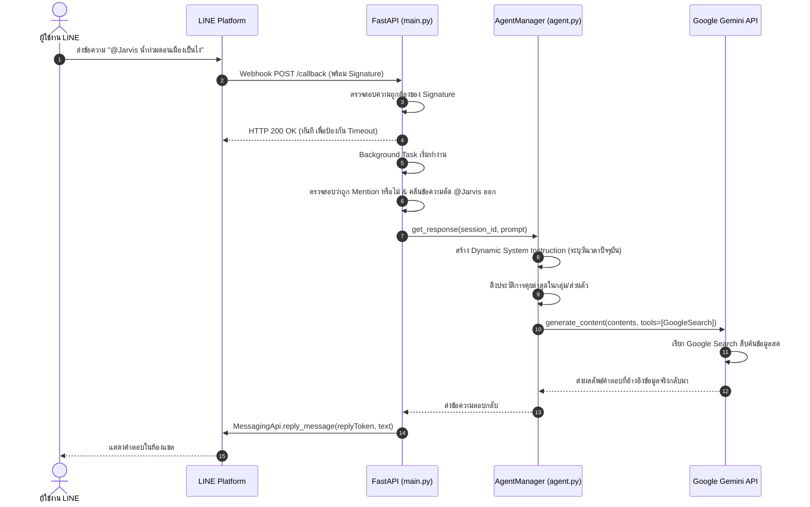

# 01. ภาพรวมสถาปัตยกรรมและการออกแบบระบบ (Architecture & Design)

## 1. ภาพรวมของระบบ (System Overview)
**ProjectJarvis** คือระบบ Personal AI Agent ที่ถูกสร้างขึ้นเพื่อให้ผู้ใช้งานสามารถสื่อสารกับ AI ได้โดยตรงผ่านแอปพลิเคชัน LINE ทั้งในรูปแบบการแชตส่วนตัว (1-on-1) และในกลุ่มสนทนา (Group Chat) โดยหัวใจหลักของระบบคือการออกแบบให้ **"ทำงานได้จริง ฉลาด ทันเหตุการณ์ และไม่มีค่าใช้จ่ายเพิ่มเติม (Zero-Cost / 100% Free Tier)"**

---

## 2. แผนผังสถาปัตยกรรม (Architecture Diagram)

```mermaid
graph TD
    User([ผู้ใช้งาน LINE]) -->|พิมพ์ข้อความ / Tag @Jarvis| LINE_App[LINE Client App]
    LINE_App -->|HTTPS Webhook POST| Render_Server[Cloud Server: Render.com<br/>(FastAPI + Uvicorn)]
    
    subgraph Webhook_Core [main.py]
        Render_Server -->|ตรวจลายเซ็น X-Line-Signature| Validator[Webhook Signature Validator]
        Validator -->|ตอบ HTTP 200 OK ทันที| LINE_App
        Validator -->|ส่งงานเข้า Background Task| Task_Handler[Background Event Processor]
        Task_Handler -->|ตรวจประเภทแชต Direct หรือ Group| Filter[Mention / Source Filter]
    end

    subgraph Agent_Brain [agent.py]
        Filter -->|ข้อความที่คลีนแล้ว| Agent_Manager[AgentManager Engine]
        Agent_Manager -->|ดึงประวัติการคุย| Memory[(Session History Memory)]
        Agent_Manager -->|แนบเวลาไทย Real-time| System_Instruction[Dynamic System Prompt]
        
        Agent_Manager -->|เรียกโมเดลหลักพร้อม Google Search| Gemini_API[Google Gemini 2.5 Flash Lite]
        Gemini_API -.->|หากติด Rate Limit / 429| Fallback[Auto-Fallback Models<br/>Gemini 3.5 / Flash Latest]
        Gemini_API -->|ค้นหาข้อมูลข่าวสารสด| Google_Search[Google Search Grounding]
        Google_Search -->|ส่งผลลัพธ์ข้อมูลกลับ| Gemini_API
    end

    Agent_Manager -->|คำตอบที่สรุปแล้ว| Task_Handler
    Task_Handler -->|ReplyMessageRequest (ฟรี)| LINE_API[LINE Messaging API]
    LINE_API -->|ส่งข้อความตอบกลับ| LINE_App
```

---

## 3. รายละเอียดเทคโนโลยี (Tech Stack)

| เลเยอร์ (Layer) | เทคโนโลยีที่เลือกใช้ | บทบาทหน้าที่ | เหตุผลที่เลือก |
| :--- | :--- | :--- | :--- |
| **Interface** | LINE Messaging API | หน้าต่างแชตที่ผู้ใช้คุ้นเคย | คนไทยใช้งานเป็นหลัก ไม่ต้องลงแอปใหม่ |
| **Backend Framework** | Python 3.9+ / FastAPI | Webhook Server | รองรับ Asynchronous, ทำงานไว, เบา |
| **Web Server** | Uvicorn (ASGI) | เซิร์ฟเวอร์รัน FastAPI | เสถียรสูง รองรับการประมวลผลพร้อมกัน |
| **AI Brain** | Google GenAI SDK | สมองประมวลผลภาษาธรรมชาติ | รองรับโมเดลตระกูล Gemini รุ่นล่าสุด |
| **Search Engine** | Google Search Grounding | เสิร์ชหาข้อมูล Real-time | ฟรี และเชื่อมต่อกับโมเดล Gemini โดยตรง |
| **Cloud Hosting** | Render.com (Web Service) | รันระบบ 24 ชั่วโมง | ฟรี มี Auto-Deploy เชื่อมต่อ GitHub |
| **Tunneling (Local Dev)** | Ngrok | ส่งสัญญาณจาก Mac สู่ภายนอก | สำหรับทดสอบรันในเครื่องก่อนขึ้น Cloud |

---

## 4. โครงสร้างไฟล์ในโปรเจกต์ (Repository Structure)

```text
ProjectJarvis/
├── .env                      # [ห้าม Push] ไฟล์เก็บค่า Secrets และ API Keys
├── .env.example              # ตัวอย่าง Template ไฟล์ .env
├── .gitignore                # ป้องกันไม่ให้ Git อัปโหลด .env, .venv, แคช
├── requirements.txt          # รายการไลบรารี Python ที่ต้องติดตั้ง
├── main.py                   # FastAPI Webhook Server, ตรวจจับ Mention, ยิง Reply
├── agent.py                  # สมอง AI, Google Search Tool, Multi-Model Fallback, Memory
├── README.md                 # เอกสารแนะนำโปรเจกต์ฉบับย่อ
└── 01-ProjectKM/             # [โฟลเดอร์นี้] คลังความรู้และคู่มือฉบับสมบูรณ์
    ├── README.md
    ├── 01_Architecture_and_Design.md
    ├── 02_LINE_Messaging_API_Guide.md
    ├── 03_Gemini_AI_Agent_Engineering.md
    ├── 04_Deployment_and_Operations.md
    └── 05_Troubleshooting_and_Lessons_Learned.md
```

---

## 5. ลำดับเหตุการณ์การทำงานแบบสมบูรณ์ (End-to-End Sequence Diagram)


