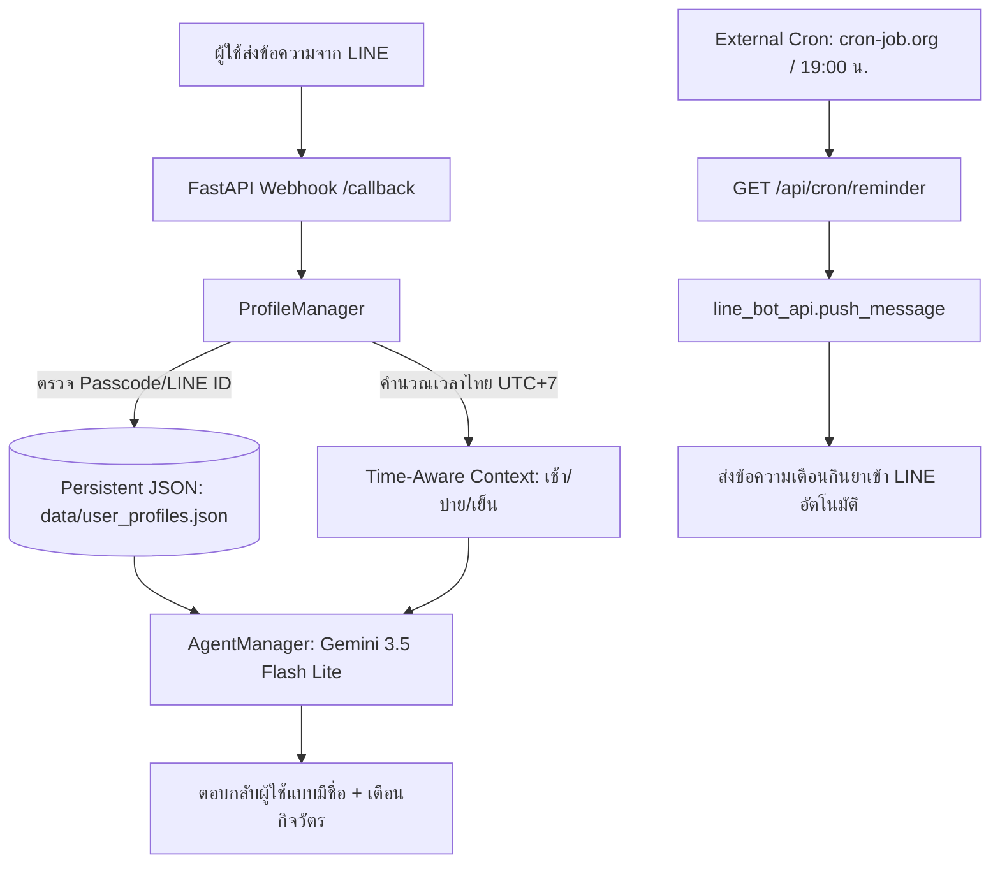

# องค์ความรู้: การจดจำตัวตนข้ามอุปกรณ์ (Cross-Device Identity) และระบบแจ้งเตือนตามกิจวัตร (Proactive Routines)

เอกสารนี้ถอดบทเรียนสถาปัตยกรรมระบบการเชื่อมต่อตัวตนข้ามเครื่อง (Cross-Device Persistent Identity) และการตอบสนองเชิงรุกตามช่วงเวลา (Time-Aware Context & Proactive Push) บน ProjectJarvis แบบ 100% Free Tier

---

## 1. ปัญหาและข้อจำกัดเดิม (Limitations)
1. **Memory สูญหายเมื่อรีสตาร์ท**: บอทเดิมเก็บประวัติบทสนทนาไว้ใน RAM (`self.histories: Dict[str, ...]`) เมื่อ Render Spin Down หรือ Deploy ใหม่ ความจำจะถูกล้างทั้งหมด
2. **ผูกติดกับ Single LINE User ID**: หากผู้ใช้เปลี่ยนเครื่องใหม่, ย้ายบัญชี LINE หรือลบบอทแล้วแอดใหม่ LINE จะสร้าง `user_id` ใหม่ ทำให้บอทจำผู้ใช้ไม่ได้
3. **ขาดมิติเวลา (Time Context)**: บอทไม่รู้ว่าผู้ใช้ทักมาเวลาไหน (เช้าหรือเย็น) จึงไม่สามารถทักทายหรือเตือนกิจวัตรตามเวลาได้
4. **Passive AI**: บอทตอบได้เฉพาะเมื่อมีคนทักมา ไม่สามารถส่งข้อความเตือนเองตามเวลา (Proactive Push) ได้

---

## 2. สถาปัตยกรรมโซลูชัน 3 เฟส (The 3-Phase Solution)



---

## 3. รายละเอียดการทำงานแต่ละส่วน

### เฟส 1: Time-Aware Context & Dynamic Routine Injection
- ตรวจสอบเวลาปัจจุบันในประเทศไทย (UTC+7):
  - **เช้า (05:00 - 11:59 น.)**: บริบทเริ่มต้นวันใหม่ วางแผนงาน
  - **บ่าย (12:00 - 16:59 น.)**: บริบททำงาน ลุยภารกิจ
  - **เย็น (17:00 - 21:59 น.)**: บริบทพักผ่อน อาหารเย็น และ **เตือนทานยาตอนเย็น**
  - **ดึก (22:00 - 04:59 น.)**: บริบทพักผ่อนนอนหลับ
- เมื่อผู้ใช้ทักเข้ามาในแต่ละช่วงเวลา ระบบจะฉีดบริบทเข้าไปใน System Instruction ของ Gemini ทำให้ Jarvis ทักทายพร้อมสอดแทรกการเตือนกิจวัตรของช่วงเวลานั้นอย่างเป็นธรรมชาติ

### เฟส 2: Cross-Device Identity & Linking via Passcode
- ข้อมูลผู้ใช้ถูกบันทึกอย่างถาวรใน `data/user_profiles.json`
- **โครงสร้างข้อมูลโปรไฟล์:**
  ```json
  {
    "pann": {
      "profile_id": "pann",
      "name": "คุณ Pann",
      "passcode": "JARVIS-PANN",
      "line_user_ids": ["Ua713f09450dfef5e75cb83df0b6b326c"],
      "routines": {
        "morning": "เตรียมตัวเริ่มต้นวันใหม่ วางแผนภารกิจประจำวัน",
        "evening": "อย่าลืมทานยาหลังอาหารเย็นเพื่อสุขภาพที่ดีของท่านครับ"
      },
      "notes": [
        "ผู้สร้างและเจ้านายของ Jarvis",
        "มีกิจวัตรสำคัญคือต้องทานยาตอนเย็นเป็นประจำ"
      ]
    }
  }
  ```
- **การกู้คืนความทรงจำเมื่อเปลี่ยนเครื่อง:**
  - ผู้ใช้พิมพ์ในแชท LINE: `ยืนยันตัวตน JARVIS-PANN` หรือ `ผูกบัญชี JARVIS-PANN`
  - ระบบจะจับคู่ `line_user_id` ใหม่ เข้ากับ Profile เดิมทันที
  - สามารถพิมพ์ `โปรไฟล์ของผม` เพื่อดูข้อมูลที่ Jarvis บันทึกไว้ได้ตลอดเวลา
  - สามารถสั่งอย่างเป็นธรรมชาติ เช่น *"ช่วยจำว่าผมต้องกินยาวันละสองเวลา"* เพื่ออัปเดตความจำได้ทันที

### เฟส 3: Proactive Scheduled Push Notification (`/api/cron/reminder`)
- สร้าง Webhook Endpoint: `/api/cron/reminder?period=evening`
- ทำงานร่วมกับบริการตั้งเวลาฟรี เช่น [cron-job.org](https://cron-job.org):
  - ตั้งเวลาให้ยิงมาที่ `https://projectjarvis-av8i.onrender.com/api/cron/reminder?period=evening` ทุกวันเวลา 19:00 น.
  - ระบบจะดึงรายชื่อผู้ใช้ทั้งหมดที่มีกิจวัตรช่วงเย็น แล้วส่ง LINE Push Notification ทักไปเตือนโดยตรงโดยที่ผู้ใช้ไม่ต้องทักมาก่อน
